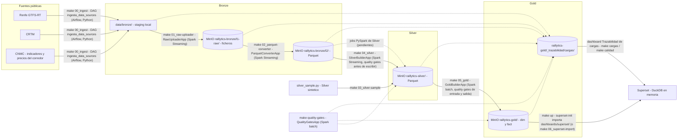

# RAILLYTICS

**Raillytics Light — Plataforma de Ingeniería de Datos para Análisis y Predicción de Demanda Ferroviaria en España**

Proyecto de TFM (Máster en Ingeniería de Datos — Grupo 3). Plataforma end-to-end que integra, procesa y analiza datos ferroviarios públicos (Renfe Open Data, AEMET, festivos BOE, INE) para generar insights operativos y predicciones de demanda a 30 días.

**Caso de uso: el corredor AVE Madrid–Barcelona.** Todos los dashboards, ejemplos y datos de muestra aplican a ese
corredor (línea `AVE-MAD-BCN`: Madrid Puerta de Atocha, Zaragoza Delicias, Camp de Tarragona y Barcelona Sants),
con los datos y los dashboards desglosados **por operador** (Renfe, Iryo, Ouigo y Avlo).

**Stack tecnológico:** Python (ingesta) · Apache Airflow (orquestación) · MinIO — S3-compatible (almacenamiento Bronze/Silver/Gold) · Spark Structured Streaming en Scala (subida a Bronze L1/L2) · PySpark (procesamiento Silver) · Delta Lake + Parquet (almacenamiento) · Spark en Scala, batch (modelo dimensional Gold; Snowflake en el diseño objetivo) · DuckDB (motor de consulta de Superset y notebooks sobre el Parquet del lake) · Apache Superset (dashboards en local; Power BI en el diseño objetivo) · Scikit-learn (modelo predictivo).

**Arquitectura:** patrón Medallion — Bronze (datos brutos) → Silver (datos limpios y enriquecidos) → Gold (modelo dimensional listo para consumo analítico).

---

## Equipo

- Elena Calcerrada Quiles
- Joaquín Ayllón Moreno
- Laura Rodríguez Mora
- Miguel Ángel Vicente Vicente
- Rubén Martínez Sierra

---

## Arquitectura de datos (Medallion)

Los datos fluyen por tres capas de calidad creciente:

```
Fuentes (Renfe, AEMET, BOE, INE)
        │  ingesta Python
        ▼
🥉 BRONZE ──► 🥈 SILVER ──► 🥇 GOLD ──────────────► Superset
   datos        PySpark        Spark (Scala) construye  (DuckDB lee el Parquet
   en bruto     limpieza       el modelo dimensional    de Gold en MinIO)
   (MinIO)      (MinIO)        y lo deja en Parquet
                               (MinIO)         └─ diseño objetivo: Snowflake ► Power BI
```

- **🥉 Bronze — datos en bruto**: un [framework de ingesta](#framework-de-ingesta-bronze) descarga las fuentes públicas y las promueve a MinIO en dos subcapas — `l1-raw` (tal cual llegan, sin transformar) y `l2` (mismo dato convertido a Parquet) — particionadas por fuente y fecha. Si algo falla después, siempre se puede volver al dato original en `l1-raw`.
- **🥈 Silver — datos limpios y enriquecidos**: la [capa Silver real](#capa-silver-real-en-streaming-make-04_silver) (`make 04_silver`, Spark Structured Streaming) construye con SQL las tablas de la CNMC desde Bronze L2, con quality gates antes de escribir; el detalle diario sigue siendo sintético (`03_silver-sample`). Los jobs PySpark previstos eliminan duplicados, tratan nulos, normalizan formatos (fechas, nombres de estaciones) y cruzan los viajeros con meteorología y festivos. Es la capa de "datos fiables".
- **🥇 Gold — datos listos para el análisis**: el modelo dimensional (dimensiones `Dim_Estacion`, `Dim_Linea`, `Dim_Operador`, `Dim_Fecha` y hechos `Fact_Viajeros`, `Fact_Puntualidad`). En este repositorio lo construye la app Spark [`GoldBuilderApp`](#capa-gold-con-spark-y-dashboards-en-superset) (Scala, batch) con SQL a partir de Silver y lo deja como Parquet en el bucket `raillytics-gold`; Superset lo consulta directamente desde ahí con DuckDB y el modelo predictivo de Scikit-learn puede leerlo igual. En el diseño del TFM el destino de este paso es Snowflake → Power BI: el SQL es el mismo y podrá ejecutarse allí cuando toque.

---

## Flujo de datos y procesos

Qué mueve los datos entre capas y con qué target de `make` se lanza cada paso. Las líneas
discontinuas hacia la trazabilidad indican que cada proceso registra sus cargas.




Cada proceso aplica además sus [Quality Gates](#quality-gates): la descarga valida el fichero recibido, L1
comprueba los bytes subidos, L2 la cabecera y los registros corruptos (lo que no pasa va a cuarentena en
`data/bronze_rejected/`), y `GoldBuilderApp` valida Silver antes de construir y Gold antes de escribir.
Los resultados quedan en `raillytics-gold/_trazabilidad/calidad/`, junto a las cargas.

---

## Estructura de directorios

```
RAILLYTICS/
├── README.md
├── G3.pdf                      # Documento de diseño del proyecto
├── Makefile                    # Targets para levantar infra y lanzar ingesta (Linux/Windows)
├── requirements.txt            # Dependencias Python del proyecto
├── .env.example                # Plantilla de variables de entorno (API keys, credenciales, MinIO, Airflow)
│
├── config/
│   ├── data_sources.yml        # Registro de fuentes (id, url, formato csv|json|zip) — lo leen Python y Scala
│   ├── quality_gates.yml       # Quality gates declarativos de Silver y Gold — los evalúa Spark (Scala)
│   ├── prediccion.yml          # Consultas de entrada de la predicción de demanda (lake -> contrato); las lee Python
│   └── prompts/                # Plantillas versionadas del prompt del LLM (demanda_v1.md, demanda_v2.md, ...)
│
├── docker/
│   ├── docker-compose.yml      # MinIO + Postgres + Airflow (LocalExecutor) + Superset + Ollama (perfil llm), local/desarrollo
│   ├── docker-compose.gpu.yml  # Override opcional: reserva de GPU NVIDIA para Ollama (LLM_GPU=1)
│   ├── init-buckets.sh         # Crea los buckets de MinIO (raillytics-bronze/-silver/-gold)
│   ├── postgres/               # init-databases.sh: crea la BD de Superset en el Postgres compartido con Airflow
│   └── superset/               # Imagen de Superset con driver DuckDB, superset_config.py y scripts de arranque/importación
│
├── dags/
│   └── ingesta_data_sources.py # DAG Airflow: descarga por fuente (dynamic task mapping sobre el YAML)
│
├── dashboards/
│   └── superset/raillytics_gold/  # Dashboards de Superset como código (Demanda, Puntualidad, Trazabilidad de cargas, Lineage de cargas, Catálogo de datos y Glosario, Predicción de demanda); se importan al arrancar
│
├── data/                       # Data Lake local — NO se versiona en git
│   ├── bronze/                 # Staging local por fuente — aquí escribe la descarga Python
│   ├── bronze_l1_done/         # Generado en runtime: ficheros ya subidos a MinIO L1, pendientes de L2
│   ├── bronze_processed/       # Generado en runtime: ficheros que ya completaron L1 y L2
│   ├── bronze_rejected/        # Generado en runtime: cuarentena (ficheros que no pasan un quality gate + .rechazo.txt)
│   ├── checkpoints/            # Generado en runtime: checkpoints de Spark Structured Streaming
│   ├── silver/                 # Datos limpios, normalizados y enriquecidos (Delta Lake)
│   └── gold/                   # Sin uso en local: Gold vive en el bucket raillytics-gold de MinIO
│
├── resultados/                 # Resultados generados que SÍ se versionan en git (a diferencia de data/)
│   └── predicciones/           # CSV de `make 07_prediccion`: <corredor>/<trimestre>/demanda_diaria_*.csv
│
├── python/
│   └── raillytics/
│       ├── ingesta/            # sources.py (registro YAML), formats.py, filenames.py, download.py (descarga a staging o cuarentena)
│       ├── calidad/            # Lado Python de los quality gates: ficheros.py (valida la descarga), registro.py (escribe resultados)
│       ├── procesamiento/      # Jobs PySpark de limpieza y enriquecimiento (capa Silver); silver_sample.py: Silver sintético
│       ├── ml/                 # Modelo predictivo Scikit-learn (features, entrenamiento, evaluación)
│       ├── prediccion/         # Predicción diaria de demanda AVE Madrid–Barcelona con un LLM de Ollama (make 07_prediccion)
│       └── utils/              # Comunes: fs.py (escritura atómica), lake.py (DuckDB + MinIO), cargas.py (trazabilidad de cargas)
│
├── build.sbt                   # Proyecto SBT (Scala 2.13 / Spark 4.2) en la raíz para que IntelliJ lo reconozca
├── project/                    # Metadatos del build SBT (build.properties)
├── src/
│   ├── main/scala/raillytics/
│   │   ├── common/             # Compartido: config (AppConfig, DotEnv), logging, spark (SparkSessionFactory), fs, lake (BronzePaths, LakeSettings, LakeViews),
│   │   │                       #   trazabilidad (Cargas), calidad (QualityGates: el framework de quality gates)
│   │   ├── ingesta/
│   │   │   ├── config/         # DataSource + SilverTabla + DataSourceConfig (lectura estricta de config/data_sources.yml)
│   │   │   ├── formats/        # SourceFormat: formatos soportados (csv, json, zip) y sus opciones de lectura
│   │   │   ├── l1/             # RawUploaderApp (main) · RawUploader (lógica) · RawUploaderSettings (entorno)
│   │   │   └── l2/             # ParquetConverterApp (main) · ParquetConverter (lógica) · ParquetConverterSettings (entorno)
│   │   ├── silver/             # SilverBuilderApp (main, streaming) · SilverBuilder (lógica) · SilverSettings · SilverSql (carga del SQL por tabla)
│   │   ├── gold/               # GoldBuilderApp (main, batch) · GoldBuilder (lógica) · GoldBuilderSettings (entorno)
│   │   └── calidad/            # QualityGatesApp (main, batch): evalúa config/quality_gates.yml sobre el lake · QualityGatesSettings
│   ├── main/resources/
│   │   ├── application.conf    # Configuración de las apps Scala (Typesafe Config): claves, defaults y variables del .env
│   │   ├── silver/             # Las tablas Silver reales en dialecto Spark SQL (una consulta por tabla)
│   │   └── gold/               # El modelo Gold en dialecto Spark SQL (una consulta por tabla)
│   └── test/scala/raillytics/  # Tests ScalaTest (mismo árbol de paquetes que main)
│
├── notebooks/                  # Notebooks de exploración y análisis (EDA, validación de fuentes)
│
├── dashboards/                 # Ficheros Power BI (.pbix) y documentación de los 4 dashboards
│
├── tests/
│   ├── ingesta/                # Tests pytest del registro de fuentes, nombres de fichero y la descarga (incluida la cuarentena)
│   ├── calidad/                # Tests pytest de los gates de fichero y del registro de resultados
│   ├── procesamiento/          # Tests pytest del Silver sintético (contrato de columnas, festivos, determinismo, traza)
│   ├── utils/                  # Tests pytest de utilidades comunes (fs, lake, trazabilidad de cargas)
│   └── prediccion/             # Tests pytest de la predicción (el e2e con Ollama real lleva el marcador llm)
│
└── docs/                       # Documentación técnica y memoria del TFM
```

---

## Framework de ingesta Bronze

Para dar de alta una fuente nueva basta con añadir una entrada a `config/data_sources.yml`
(`id`, `name`, `url`, `format` — `csv`, `json` o `zip` —, y opcionalmente `options`, `checks` y `silver`). El resto del pipeline no necesita cambios:

```
config/data_sources.yml
        │
        ▼
DAG Airflow "ingesta_data_sources"  (una tarea de descarga por fuente)
        │   quality gates de fichero: no vacío, el contenido ES el formato declarado (+ tamaño, cabecera y filas si la fuente los declara)
        ├──► data/bronze_rejected/<source>/   ← cuarentena (+ <fichero>.rechazo.txt); la tarea falla
        ▼
data/bronze/<source>/                  ← Python escribe aquí (staging local)
        │
        ▼  App Scala "raw-uploader" (Spark Structured Streaming)
        │   copia el fichero tal cual a MinIO: raillytics-bronze/l1-raw/<source>/<fecha>/
        │   quality gate: bytes subidos = bytes del fichero local
        ▼
data/bronze_l1_done/<source>/
        │
        ▼  App Scala "parquet-converter" (Spark Structured Streaming, 1 query por fuente)
        │   convierte a Parquet en MinIO: raillytics-bronze/l2/<source>/<fecha>/  (zip: .../<fecha>/<miembro>/)
        │   quality gates: cabecera csv = esquema de la query, sin registros corruptos, zip válido
        ├──► data/bronze_rejected/<source>/   ← cuarentena; el resto del micro-batch se convierte
        ▼
data/bronze_processed/<source>/
```

Los formatos: `csv` (texto con cabecera), `json` (un único documento, como los feeds GTFS-RT
de Renfe) y `zip` (archivo cuyos miembros `.txt`/`.csv` se leen como CSV: es lo que sirve
CRTM, un GTFS estático con `stops.txt`, `routes.txt`, `trips.txt`...; L2 deja un prefijo
Parquet por miembro). La descarga comprueba que lo recibido es realmente ese formato:
antes, con CRTM declarado como `csv`, L2 convertía los bytes del ZIP a Parquet sin que
nada avisara.

Los directorios de `data/` son **hermanos, no anidados** — es un detalle de diseño
deliberado: Spark recorre recursivamente cualquier subdirectorio alcanzable bajo una ruta
que ya haya hecho *match* con un glob, así que anidarlos reintroduciría una carrera entre
las dos apps (cada una movería ficheros que la otra todavía no ha procesado).

Las dos apps son **idempotentes frente a reinicios**: si el proceso muere a mitad de un
micro-batch, Spark vuelve a entregar el mismo batch al arrancar. L1 omite los ficheros ya
movidos y vuelve a subir (sobrescribiendo) los que siguen en el staging; L2 deja un
marcador por batch en su checkpoint (`raillytics-batches/<batchId>`) y, si lo encuentra,
solo termina de mover ficheros sin volver a escribir Parquet (sin duplicados en `l2`).
Borrar `data/checkpoints/` reprocesa todo, marcadores incluidos.

### Opciones, reglas de descarga y tablas Silver por fuente

Cada entrada de `config/data_sources.yml` admite estas claves. **Una clave desconocida es un error** (en Python y en Scala): un
typo como `optons` no se ignora en silencio.

| Clave | Obligatoria | Qué es |
| --- | --- | --- |
| `id`, `name`, `url`, `format` | sí | identificador, nombre, de dónde se descarga y `csv`/`json`/`zip` |
| `options` | no | cómo se lee un `csv`: `delimiter` (un carácter) y `encoding`. Los usan la descarga y L2 |
| `checks` | no | reglas de la descarga sobre un `csv`: `min_bytes`, `min_filas` y `columnas` (la cabecera esperada) |
| `silver` | no | tablas que construye `make 04_silver` desde la fuente: lista de `{tabla, modo}` con modo `snapshot` o `incremental` |

`options`, `checks` y `silver` solo se admiten en fuentes `csv`, y una tabla Silver no puede declararla más de una fuente. Ejemplo
(la fuente de indicadores de la CNMC, CSV con `;` y BOM; hay además dos fuentes de demanda trimestral, cada una con su tabla Silver:
`cnmc_viajeros_producto`, total nacional por tipo de producto, y `cnmc_viajeros_corredor`, LD AV por corredor y empresa, que concuerda con
`cnmc_indicadores`):

```yaml
  - id: cnmc_indicadores
    name: "CNMC - Indicadores trimestrales del transporte ferroviario de viajeros"
    url: "https://catalogodatos.cnmc.es/dataset/…/download/ds_24406_1.csv"
    format: csv
    options: {delimiter: ";"}
    checks:
      min_bytes: 10000
      min_filas: 400
      columnas: ["Trimestre", "Tipo de producto", "Corredor", "Empresa", …]
    silver:
      - {tabla: cnmc_trimestral, modo: snapshot}
```

Los gates de la descarga, por este orden: `contenido_no_vacio`, `formato_declarado` (con el delimitador declarado),
`content_type` (aviso), `tamano_minimo` (`min_bytes`), `cabecera_esperada` (`columnas`, sin BOM y sin distinguir mayúsculas) y
`filas_minimas` (`min_filas`). Los tres últimos solo se evalúan si la fuente los declara **y** el formato ha pasado, de modo que
una página de mantenimiento con código 200 se rechaza por `formato_declarado` y no por tres motivos a la vez.

### Arranque rápido (local)

Con Docker y `make` instalados (`choco install make` / `scoop install make` en Windows):

```bash
make install-dev-env        # crea .venv (Python 3.9–3.12), instala requirements.txt,
                            # activa los git hooks y copia .env.example -> .env
                            # (rellena las credenciales: nunca valores por defecto)
make up                     # levanta MinIO + Postgres + Airflow + Superset
make 00_ingest              # levanta Ollama y dispara el DAG de descarga una vez (+ predicción de demanda al final)
                            # (descarga también las fuentes de la CNMC; L2 se reinicia una vez para que lea las fuentes nuevas)
make 01_raw-uploader        # en una terminal aparte — app L1 (queda en primer plano)
make 02_parquet-converter   # en otra terminal aparte — app L2 (queda en primer plano)
make 03_silver-sample       # Silver sintético en MinIO: el detalle diario (estación, operador, puntualidad), que no existe como dato abierto
make 04_silver              # Silver REAL en streaming (terminal aparte, queda en primer plano): Bronze L2 -> Silver con quality gates
make quality-gates          # (opcional) valida Silver/Gold del lake con config/quality_gates.yml; falla si hay gates bloqueantes
make 05_gold                # construye la capa Gold con la app Spark -> Parquet en raillytics-gold
                            # (valida Silver a la entrada y Gold a la salida, antes de escribir)
                            # Superset: http://localhost:8088 (SUPERSET_ADMIN_USER / _PASSWORD del .env)
make cargas                 # últimas cargas registradas      make calidad   # últimos quality gates
```

`make help` lista todos los targets disponibles (`up`/`down`, `test`, `test-python`,
`test-scala`, `clean`, etc.).

Detrás de un proxy TLS corporativo (Zscaler) las descargas del DAG fallan dentro del
contenedor con `CERTIFICATE_VERIFY_FAILED`: deja el certificado raíz en `config/certs/`
(ignorado por git) y apunta `AIRFLOW_CA_BUNDLE` del `.env` a su ruta dentro del contenedor
(ver `.env.example`).

`install-dev-env` es idempotente: solo recrea el venv si no existe y solo reinstala
dependencias si cambia `requirements.txt`. Por defecto crea el venv con `py -3.12` en
Windows y `python3` en Linux/macOS (numpy 1.26 y pyarrow 16 no tienen wheels para
Python 3.13+); se puede cambiar con `make install-dev-env VENV_BASE_PYTHON=python3.11`.
Los targets que necesitan dependencias Python (`test-python`, `03_silver-sample`,
`cargas`) usan directamente el intérprete de `.venv`, así que no hace falta
activarlo antes de llamar a `make`.

### Configuración: `.env` y `application.conf`

Todo lo que depende de la máquina (puertos, credenciales, rutas locales, buckets) vive en el
`.env` de la raíz (plantilla en `.env.example`). Lo leen docker-compose (`env_file`), el Makefile
(que lo exporta a todos los subprocesos) y el lado Python (`python-dotenv`). Las apps Scala usan
[Typesafe Config](https://github.com/lightbend/config): las claves y sus valores por defecto están
en `src/main/resources/application.conf` (HOCON), y `raillytics.common.config.AppConfig` monta la
pila de fuentes con esta precedencia: propiedades de la JVM (`-Dclave=valor`) > variables de
entorno > `.env` del proyecto > `application.conf`. Como las apps y los tests leen el `.env`
directamente, funcionan igual desde `make`, desde `sbt` a secas o desde el IDE.

| Clave de `application.conf` | Variable del `.env` | Valor por defecto |
| --- | --- | --- |
| `raillytics.minio.endpoint`, `.user`, `.password` | `MINIO_ENDPOINT`, `MINIO_ROOT_USER`, `MINIO_ROOT_PASSWORD` | `http://localhost:9000`, vacíos |
| `raillytics.minio.buckets.{bronze,silver,gold}` | `MINIO_BUCKET_{BRONZE,SILVER,GOLD}` | `raillytics-bronze`, `-silver`, `-gold` |
| `raillytics.lake.{silver,gold,trazabilidad}-root` | `SILVER_ROOT`, `GOLD_ROOT`, `TRAZABILIDAD_ROOT` | `s3a://<bucket>`; trazabilidad: `<gold>/_trazabilidad` |
| `raillytics.ingesta.{data-sources,staging-root,l1-done-root,processed-root,rejected-root,checkpoint-root}` | `DATA_SOURCES_CONFIG`, `STAGING_ROOT`, `L1_DONE_ROOT`, `PROCESSED_ROOT`, `REJECTED_ROOT`, `CHECKPOINT_ROOT` | `config/data_sources.yml`, `data/bronze`, `data/bronze_l1_done`, `data/bronze_processed`, `data/bronze_rejected`, `data/checkpoints` |
| `raillytics.ingesta.l2.pending-retry` | — | `30 seconds` |
| `raillytics.spark.master`, `raillytics.spark.s3a.*` | `SPARK_MASTER` | `local[*]`; path-style sí, TLS no |
| `raillytics.gold.umbral-puntualidad-min` | — | `5` |
| `raillytics.calidad.config` | `QUALITY_GATES_CONFIG` | `config/quality_gates.yml` |
| — (solo docker-compose, contenedor de Airflow) | `AIRFLOW_CA_BUNDLE` | vacío (certificados del sistema) |

Los prefijos `l1-raw/` y `l2/` de Bronze y los nombres de las tablas Gold no están en la
configuración: son parte del contrato del lake, que también conocen Superset y el lado Python.

---

## Capa Silver real en streaming (`make 04_silver`)

`SilverBuilderApp` (Scala, Spark Structured Streaming) es, junto a L1 y L2, la tercera app que se queda **en primer plano**: lee Bronze L2
y construye las tablas Silver declaradas en `config/data_sources.yml` (clave `silver`), una query de streaming por tabla.

```
Airflow (DAG diario) ─► data/bronze/<fuente>/ ─L1─► s3a://bronze/l1-raw/…
                                                └─L2─► s3a://bronze/l2/<fuente>/<fecha>/part-*.parquet
                                                            │  readStream (Parquet, ficheros nuevos)
                                                            ▼
                            make 04_silver  (una query por tabla · SQL por tabla · gates · cuarentena · trazabilidad)
                                                            ▼
                                            s3a://silver/cnmc_trimestral/ …  (Parquet)
                                                  │                              │
                                    make 05_gold (batch)                  predicción (DuckDB)
                                                  ▼
                                  s3a://gold/fact_mercado_trimestral …  ─► Superset (DuckDB)
```

- **Transformación**: SQL de Spark en `src/main/resources/silver/<tabla>.sql`, como Gold. Lee la vista `entrada` (que incluye
  `_source_file` y `_fecha_ingesta`) y devuelve la tabla Silver. Los números se leen con `try_cast` (en Spark 4, ANSI, un `cast` inválido
  tumbaría la query): un dato malo queda `NULL` y lo detienen los gates, no una excepción.
- **Modos**: `snapshot` (la CNMC): cada descarga es una foto completa; el micro-batch solo *dispara* la reconstrucción desde la **última**
  partición `l2/<fuente>/<fecha>/` y el resultado sustituye la tabla (un `part-*.parquet`, `overwrite`, como Gold), así que es idempotente.
  `incremental`: `entrada` es el contenido del micro-batch y el resultado se añade; la deduplicación por clave va en el propio SQL.
- **Calidad (fail closed)**: antes de escribir se evalúan los gates `silver_<tabla>` de `config/quality_gates.yml`. Si falla alguno
  bloqueante, Silver **se queda como estaba**, el resultado va a `silver/_cuarentena/<tabla>/<fecha>-<batchId>/`, la trazabilidad registra
  un `error` con los gates fallidos y el stream **sigue vivo** (la siguiente descarga buena lo corrige). Un error del propio SQL (código roto,
  no datos malos) termina el proceso, como L2.
- **Idempotencia**: marcador por batch en `data/checkpoints/silver/<tabla>/raillytics-batches/<batchId>`: un batch repetido tras un reinicio no
  vuelve a escribir. Si una tabla aún no tiene ficheros en L2, queda pendiente y se reintenta cada `raillytics.silver.pending-retry` (30 s).
- **Ajustes** (`application.conf`): `raillytics.silver.trigger-interval` (30 s) y `raillytics.silver.pending-retry` (30 s).

Para **añadir una tabla**: una entrada `silver:` en su fuente, `src/main/resources/silver/<tabla>.sql`, los gates `silver_<tabla>` en
`config/quality_gates.yml` y, si puede no existir aún, su nombre en `opcionales:`. No hay que tocar código Scala.

El Silver sintético (`03_silver-sample`) y el real **conviven** en el mismo bucket con tablas distintas: el sintético aporta el detalle diario
y el real, los indicadores trimestrales del corredor (viajeros, plazas, tren·km, ingresos y precio medio por operador) de la CNMC, más dos
tablas de demanda en **millones** (`cnmc_viajeros_producto`, total nacional por tipo de producto, y `cnmc_viajeros_corredor`, LD AV por corredor
y empresa; Gold todavía no las usa). Como L2 lee
las fuentes del YAML al arrancar, hay que **reiniciar `make 02_parquet-converter` una vez** tras añadir una fuente.

---

## Capa Gold con Spark y dashboards en Superset

En local la capa Gold no necesita un data warehouse: la app **Spark** `GoldBuilderApp`
(Scala, batch) construye el modelo dimensional leyendo Silver de MinIO y lo deja como Parquet
en el bucket `raillytics-gold`, y **Superset** lo consulta directamente desde ahí con
**DuckDB** en memoria dentro del contenedor. Es el mismo modelo que en el diseño del TFM
se carga en Snowflake; solo cambia el destino.

```
Silver (Parquet en MinIO)              Gold (Parquet en MinIO)                Superset (http://localhost:8088)
raillytics-silver/                     raillytics-gold/
  viajeros_enriquecidos/    Spark        dim_fecha/       dim_estacion/       DuckDB en memoria + httpfs:
  puntualidad_enriquecida/  ───────►     dim_linea/       fact_viajeros/  ◄── read_parquet('s3://raillytics-gold/...')
                         GoldBuilderApp  dim_operador/    fact_puntualidad/
```

### Cómo se ejecuta

| Paso | Comando | Qué hace |
| --- | --- | --- |
| Silver de ejemplo | `make 03_silver-sample` | Genera un Silver sintético y determinista (365 días, semilla 42) en `raillytics-silver`, **solo del corredor AVE Madrid–Barcelona** (una línea, sus cuatro estaciones y cuatro operadores: Renfe, Iryo, Ouigo y Avlo, con cuota de mercado, servicios, retrasos y cancelaciones propios; Avlo es la marca low cost de Renfe). Sustituye a los jobs PySpark mientras no existan y produce exactamente las columnas que Gold espera (el contrato está en `python/raillytics/procesamiento/silver_sample.py`). Los datos no son reales. |
| Silver real | `make 04_silver` | Streaming en primer plano: Bronze L2 → tablas Silver de la CNMC con gates, cuarentena y trazabilidad (ver [Capa Silver real](#capa-silver-real-en-streaming-make-04_silver)). |
| Quality gates | `make quality-gates` | `sbt "runMain raillytics.calidad.QualityGatesApp"` (batch): evalúa `config/quality_gates.yml` sobre lo que hay en Silver y Gold, registra los resultados y termina con error si falla algún gate bloqueante. No escribe datos: es la barrera entre pasos. `QG_ARGS=silver`, `gold` o el nombre de una tabla acotan la evaluación. |
| Gold | `make 05_gold` | `sbt "runMain raillytics.gold.GoldBuilderApp"` (batch, con la misma configuración s3a que L1/L2): registra las tablas Silver como vistas, aplica los gates `silver_*` (entrada), ejecuta `src/main/resources/gold/<tabla>.sql` para todas las tablas en memoria, aplica los gates `gold_*` (salida) y solo entonces escribe cada tabla en `s3a://raillytics-gold/<tabla>/` (un `part-*.parquet` por tabla, full refresh). Si existe el Silver real de la CNMC (`make 04_silver`), construye además el grupo opcional «mercado» (tres tablas); si no, Gold es el de siempre. Si un gate bloqueante falla, Gold se queda como estaba. No es un stream como L1/L2 porque las dimensiones se recalculan sobre todo Silver. |
| Dashboards | `make up` (o `make 06_superset-import`) | El servicio `superset-init` importa `dashboards/superset/raillytics_gold/` en cada arranque; `06_superset-import` repite la importación sin reiniciar. |

Gold no tiene DAG de Airflow: la app Spark corre fuera de los contenedores, como L1/L2
(orquestarla desde Airflow requeriría un `SparkSubmitOperator` contra un clúster o una imagen
con JDK y sbt). Los dos comandos leen la configuración de MinIO de las variables `MINIO_*` del
`.env`; con `SILVER_ROOT`, `GOLD_ROOT` y `TRAZABILIDAD_ROOT` se puede apuntar a directorios
locales (así corren los tests, sin MinIO).

### Modelo Gold

| Tabla | Grano | Columnas principales |
| --- | --- | --- |
| `dim_fecha` | día | `fecha_id` (AAAAMMDD), `fecha`, `anio`, `trimestre`, `mes`, `nombre_mes`, `dia_semana` (1 = lunes), `nombre_dia`, `es_fin_de_semana`, `es_festivo`, `festivo_nombre`, `estacion_anio` |
| `dim_estacion` | estación | `estacion_id`, `nombre`, `provincia`, `comunidad`, `latitud`, `longitud` |
| `dim_linea` | línea | `linea_id`, `nombre`, `tipo_tren`, `origen`, `destino` |
| `dim_operador` | operador | `operador_id`, `nombre`, `empresa`, `segmento` (alta velocidad o low cost) |
| `fact_viajeros` | día × estación × línea × operador | `fecha_id`, `fecha`, `estacion_id`, `linea_id`, `operador_id`, `viajeros`, `temperatura_media`, `precipitacion_mm`, `condicion_meteo` |
| `fact_puntualidad` | servicio (tren) | `fecha_id`, `fecha`, `linea_id`, `operador_id`, `estacion_id`, `servicio_id`, `hora_prevista`, `hora_real`, `hora`, `retraso_min`, `estado`, `cancelado`, `es_puntual` (retraso ≤ 5 min), meteo |
| `fact_mercado_trimestral` (*) | trimestre × corredor × operador | `anio`, `trimestre`, `fecha_inicio`, `linea_id`, `operador_id`, `viajeros`, `plazas_ofertadas`, `plazas_km`, `tren_km`, `viajeros_km`, `ingresos_eur` |
| `fact_precio_trimestral` (*) | trimestre × corredor × operador | `anio`, `trimestre`, `fecha_inicio`, `linea_id`, `operador_id`, `precio_medio_eur` |
| `fact_precio_mensual` (*) | mes × corredor × operador | `anio`, `mes`, `fecha_inicio`, `linea_id`, `operador_id`, `precio_medio_eur` |

(*) **Grupo opcional «mercado»** (datos reales de la CNMC, solo el corredor Madrid–Barcelona): se construye solo si existen las tres tablas
Silver de `make 04_silver`. `operador_id` incluye `TOTAL` (la fila del corredor completo; en la demanda solo lleva `ingresos_eur`) y `OTRO`
(una empresa que la CNMC añada y aún no esté en `dim_operador`; avisa, no rompe). En la **demanda Avlo va dentro de RENFE** (la CNMC no la
separa); en los **precios** `RENFE` es Renfe-AVE y `AVLO` es Renfe-AVLO. «Viajeros por plaza ofertada» no es ocupación: un asiento sirve a varios tramos.

### Superset

- **Conexión**: la base de datos `Raillytics Gold (DuckDB)` es `duckdb:///:memory:` con la
  extensión `httpfs` precargada. Al arrancar, el contenedor guarda las credenciales de MinIO del
  `.env` como *secret* persistente de DuckDB (`docker/superset/superset-run.sh` ejecuta
  `python -m raillytics.utils.lake persist-secret`), así el YAML versionado no contiene
  credenciales. En SQL Lab se puede consultar Gold tal cual:
  `SELECT * FROM read_parquet('s3://raillytics-gold/dim_linea/*.parquet')`.
- **Datasets**: dos datasets virtuales que hacen el *star join* de cada tabla de hechos con sus
  dimensiones (`viajeros_diarios` y `puntualidad_servicios`), con las métricas guardadas
  (`total_viajeros`, `media_viajeros_dia`, `pct_puntuales`, `retraso_medio`, `retraso_p90`...).
- **Dashboards de ejemplo, todos del corredor AVE Madrid–Barcelona:** *Demanda ferroviaria* (viajeros por
  estación, **cuota, evolución semanal y resumen por operador**, evolución diaria por estación, % de viajeros en fin de
  semana, reparto por época del año, día de la semana, festivos, meteorología y comunidades) y *Puntualidad*
  (% puntuales, retraso medio, **puntualidad por operador y su evolución mensual**, evolución mensual y diaria por
  estación de llegada, tabla por estación, franja horaria × día de la semana, tipo de día, meteorología, estaciones
  críticas), con filtros nativos de fechas, **operador**, estación y comunidad (o tipo de día). Los datasets
  `viajeros_diarios` y `puntualidad_servicios` **filtran por `AVE-MAD-BCN`**: aunque lleguen datos de otras líneas,
  los dashboards solo muestran el corredor. La predicción es del total del corredor (no hay demanda trimestral por
  operador en sus fuentes). Los otros dos son *Predicción de demanda* y *Trazabilidad de cargas*
  (esta última habla del lake, no del corredor), que se describen más abajo.
- **Mercado del corredor (datos reales de la CNMC)**: el dashboard *Mercado del corredor · AVE Madrid–Barcelona* (14 gráficos, filtros de fechas y
  operador) muestra viajeros por trimestre y operador, cuota, viajeros por plaza ofertada, tren·km, ingresos, precio medio mensual y el *backtest* de la
  regla de nivel de la predicción contra los trimestres reales. Sus cuatro datasets (`mercado_trimestral`, `precio_medio_trimestral`,
  `precio_medio_mensual`, `backtest_nivel`) dan «no hay ficheros» hasta que exista el Gold de mercado: lanza `make 04_silver` y `make 05_gold`.
- **Metastore**: Superset guarda sus metadatos en la base de datos `superset` del mismo Postgres
  que usa Airflow (servicio `postgres`, variables `POSTGRES_USER`/`POSTGRES_PASSWORD` del `.env`);
  `docker/postgres/init-databases.sh` la crea al inicializar el volumen.
- **Dashboards como código**: `dashboards/superset/raillytics_gold/` está en el formato de
  exportación de Superset (`metadata.yaml` + `databases/`, `datasets/`, `charts/`, `dashboards/`).
  Para cambiar un dashboard: edítalo en la UI, expórtalo (Dashboards → Export), descomprime el
  ZIP sobre esa carpeta y haz commit. Al importar, los dashboards se sobrescriben, pero la base
  de datos, los datasets y los charts se identifican por `uuid` y se conservan si ya existen
  (para rehacerlos desde el YAML hay que borrarlos antes en la UI o cambiar su `uuid`).
- **Imagen**: `docker/superset/Dockerfile` añade a `apache/superset:6.1.0` los drivers `duckdb`,
  `duckdb-engine` y `psycopg2` (metastore en Postgres) y deja `httpfs` instalada para no depender
  de internet en runtime. Se construye sola la primera vez; para reconstruirla:
  `docker compose -f docker/docker-compose.yml --env-file .env build superset`.
- **Limitaciones**: el nombre del bucket (`raillytics-gold`) va escrito en el SQL de los datasets;
  si cambias `MINIO_BUCKET_GOLD` hay que actualizarlo también ahí. No hay Redis ni Celery (un solo
  worker de gunicorn), suficiente para desarrollo.

### Trazabilidad de cargas

Cada proceso de carga deja constancia de lo que ha hecho en una tabla Parquet del lake,
`s3://raillytics-gold/_trazabilidad/cargas/` (un fichero por ejecución, una fila por tabla
cargada): `run_id`, `proceso`, `capa`, `tabla`, `origen`, `destino`, `filas`, `bytes`,
`inicio`/`fin` (UTC), `duracion_s`, `estado` (`ok`/`error`), `error`, `parametros` (JSON),
`lanzado_por` (`make`, `airflow:<dag>`, `cli`), `ejecutor` y `usuario`. Ya lo hacen la descarga
Bronze del DAG `ingesta_data_sources`, las apps Spark L1 (`bronze_l1_raw_uploader`: una fila por
fichero subido, dentro de cada micro-batch de Structured Streaming) y L2
(`bronze_l2_parquet_converter`: una fila por micro-batch y fuente, más una en `error` por cada
fichero enviado a cuarentena), el Silver sintético (`silver_sample`), la construcción de Gold
(`gold_build`) y la validación del lake (`quality_gates`).

Para instrumentar un proceso nuevo basta con envolverlo. En Python
(`python/raillytics/utils/cargas.py`):

```python
from raillytics.utils.cargas import registrar_carga

with registrar_carga("silver_viajeros", "silver", layout, con, parametros={...}) as ejecucion:
    with ejecucion.tabla("viajeros_enriquecidos", origen=..., destino=...) as carga:
        ...                 # la carga propiamente dicha
        carga.filas = n
```

Y en Scala (`raillytics.common.trazabilidad.Cargas`, mismo esquema Parquet; Spark añade sus
`part-*.parquet` al mismo prefijo y DuckDB los lee junto a los de Python):

```scala
Cargas.registrar("silver_viajeros", "silver", settings.cargasDir, Map("particion" -> dia)) { ejecucion =>
  ejecucion.tabla("viajeros_enriquecidos", origen = Some(...), destino = Some(...)) { carga =>
    ...                   // la carga propiamente dicha
    carga.filas = Some(n)
  }
}
```

El registro se escribe al terminar, también si la carga falla (el error queda en la fila y la
excepción se propaga); si el registro no se puede escribir, se avisa en el log pero la carga no
falla por eso. `make cargas` lista las últimas ejecuciones desde la terminal, y el dashboard
*Trazabilidad de cargas* de Superset muestra ejecuciones, errores, anomalías de volumen detectadas
(comparativa frente a la media histórica de la tabla), filas cargadas por día y tabla, duración por proceso,
la última carga de cada tabla (en rojo si hace más de 24 h), los quality gates de cada carga y el historial completo.
`TRAZABILIDAD_ROOT` cambia la ubicación del registro (por defecto, dentro del bucket Gold).

Junto a `cargas/` vive `_trazabilidad/calidad/`, con una fila por quality gate evaluado y el
**mismo `run_id`** que la carga a la que pertenece (ver [Quality Gates](#quality-gates)).

### Lineage de cargas (dashboard organizado por pestañas)

El dashboard *Lineage de cargas* (`/superset/dashboard/lineage-cargas/`) dibuja el recorrido de los datos **de la fuente al dashboard**:
fuente → staging → Bronze L1 → L2 → Silver → Gold → dataset → dashboard, más los generadores sintéticos y la predicción con su LLM.
La interfaz está organizada en **pestañas temáticas** para una navegación ágil sin scroll excesivo:

- **Visión Global y Flujo**: **Sankey** (flujo de izquierda a derecha, grosor según las filas de la última carga) y **grafo** interactivo de fuerzas (un color por capa, nodos arrastrables, leyenda para ocultar capas); cada salto lleva su proceso y transformación (`silver/<tabla>.sql`, `gold/<tabla>.sql`, descarga del DAG, copia a MinIO…).
- **Nodos y Calidad**: el estado de cada nodo (ok, aviso, error, sin ejecutar, no aplica) y las **reglas de calidad** con su último resultado evaluado (filtrable interactivamente por nodo).
- **Zoom por Ejecución**: vista detallada por carga con el grafo del recorrido de los `run_id` seleccionados, las **ejecuciones con su error y los enlaces directos al log de la tarea de Airflow** (solo las descargas pasan por Airflow).

Dos capas de información, que se cruzan en el SQL de los datasets:

- **Declarada** (qué debería existir): se **genera del repositorio** (`raillytics.lineage.grafo`): `config/data_sources.yml`, la clave `silver:` de
  cada fuente y su SQL, las tablas `silver_*`/`gold_*` que cita cada `src/main/resources/gold/*.sql` (la trazabilidad solo guarda
  `origen = s3a://raillytics-silver`, sin decir de qué tablas), `config/prediccion.yml`, `config/quality_gates.yml` y los datasets y dashboards de
  `dashboards/superset/`. Un nodo declarado que nunca se ha ejecutado figura como **sin ejecutar**.
- **Observada** (qué se cargó): `_trazabilidad/cargas/` y `_trazabilidad/calidad/`. Cada app registra sus tablas a su manera (`crtm/stops`,
  `silver_cnmc_trimestral`…) y `raillytics.lineage.datasets` las lleva al nodo que les corresponde.

Estado de un nodo: **error** si su última carga falló o falla un gate bloqueante, **aviso** si solo falla un gate de aviso, **ok**, **sin ejecutar**
o **no aplica** (fuentes, datasets y dashboards no se cargan).

```bash
make lineage                 # regenera los datasets lineage_*.yaml desde el repo (hazlo al cambiar fuentes, SQL, gates o dashboards)
make 06_superset-import      # y reimporta el dashboard
```

Un test (`tests/lineage/test_sincronia.py`) falla si los YAML versionados no coinciden con lo que generaría `make lineage`. Los enlaces al log usan
`http://localhost:8080` (la UI de Airflow del compose); `AIRFLOW_UI_URL` en el `.env` lo cambia. Para esos enlaces la descarga guarda su
referencia de Airflow (`dag_id`, `run_id`, `task_id`, `map_index`) en `parametros.airflow` de su fila de trazabilidad.

### Catálogo de Datos y Glosario de Términos

El dashboard *Catálogo de datos y Glosario de términos* (`/superset/dashboard/catalogo-datos-glosario/`) actúa como centro de gobernanza y documentación viva de Raillytics:

- **Catálogo de Datos**: inventario interactivo de todos los datasets de las capas Bronze (L1 y L2), Silver, Gold y Metadatos. Detalla para cada tabla su dominio funcional, granularidad/grano, claves primarias, formato (Delta Lake, Parquet, CSV, JSON), proceso productor, frecuencia de refresco, dependencias (upstream/downstream), quality gates asociados y diccionario de columnas con tipos de dato.
- **Glosario de Términos**: diccionario formal con términos de negocio ferroviario (Corredor, Plazas Ofertadas, Plazas·km, Viajeros, Viajeros·km, Tren·km, Cuota de Mercado, Factor de Ocupación, Puntualidad Comercial, Retraso Medio, OSP, Servicios Liberalizados) y términos técnicos de plataforma (Arquitectura Medallion, Bronze L1/L2, Silver, Gold, Quality Gate Bloqueante/Aviso, Trazabilidad, Linaje, Frescura, Run ID), junto con sus fórmulas de cálculo y tablas relacionadas.

La información se define en `config/data_catalog.yml` y `config/glosario.yml`, y se genera como datasets de DuckDB para Superset (`data_catalog`, `catalogo_columnas`, `glosario_terminos`):

```bash
make catalog                 # regenera los datasets del catálogo y glosario en dashboards/superset/
make 06_superset-import      # y reimporta los dashboards en Superset
```

Un test (`tests/catalog/test_catalog.py`) comprueba la integridad de la configuración y asegura que los datasets versionados coinciden exactamente con lo declarado.

---

## Quality Gates

Un *quality gate* es una comprobación que decide si una carga se promociona o no. El
framework vive en Scala (`raillytics.common.calidad.QualityGates`) y usa Spark SQL como
motor: los gates se declaran por tabla en `config/quality_gates.yml`, se traducen a una
consulta que devuelve un número y se comparan con un umbral. Cada gate tiene una severidad:

- **bloqueante**: si falla (o no se puede evaluar: fail closed), el proceso lanza
  `QualityGateException`, la carga queda con `estado = error` en la trazabilidad y **no se
  escribe nada** en la capa destino.
- **aviso**: se registra y la carga sigue.

Las tablas **opcionales** se declaran en la clave de primer nivel `opcionales:` del YAML: son las que pueden no existir aún en el lake (el
Silver real de `make 04_silver` y su Gold «mercado»). Si su vista no se puede registrar, `make quality-gates` y `make 05_gold` las
**omiten con un aviso** en vez de dejar sus gates en `error` (que es bloqueante); pedir una por su nombre (`QG_ARGS=silver_cnmc_trimestral`) la
vuelve obligatoria. Cada nombre de `opcionales:` debe tener sus gates en `tablas:` (un typo no omite nada en silencio).

Las tablas se nombran `<capa>_<tabla>` (`silver_viajeros_enriquecidos`, `gold_dim_fecha`...),
que son las vistas que registran las apps (`LakeViews`). Tipos disponibles:

| Tipo | Parámetros | Pasa si |
| --- | --- | --- |
| `filas_min` | `minimo` | `count(*) >= minimo` |
| `no_nulos` | `columnas` | ninguna fila tiene nulos en esas columnas |
| `unico` | `columnas` | no hay filas duplicadas por esas columnas (clave o grano) |
| `dominio` | `columna`, `valores` | ningún valor fuera de la lista |
| `rango` | `columna`, `minimo` y/o `maximo` | ningún valor fuera de `[minimo, maximo]` |
| `referencia` | `columnas`, `tabla`, `columnas_destino?` | toda clave existe en la tabla destino (integridad referencial) |
| `sql` | `sql`, `maximo` (0 por defecto), `minimo?` | la consulta (que devuelve un número) queda dentro del umbral; sirve para cruzar tablas, p. ej. conciliar filas y sumas de Gold con Silver |

```yaml
tablas:
  gold_fact_viajeros:
    - {nombre: grano_unico,         tipo: unico,      columnas: [fecha_id, estacion_id, linea_id, operador_id], severidad: bloqueante}
    - {nombre: lineas_en_dim_linea, tipo: referencia, columnas: [linea_id], tabla: gold_dim_linea,  severidad: bloqueante}
    - {nombre: viajeros_conciliados, tipo: sql, severidad: bloqueante,
       sql: "SELECT abs((SELECT sum(viajeros) FROM gold_fact_viajeros) - (SELECT sum(viajeros) FROM silver_viajeros_enriquecidos))"}
```

Dónde se aplican:

| Paso | Gates | Qué pasa si fallan |
| --- | --- | --- |
| Descarga (Python, DAG) | `contenido_no_vacio`, `formato_declarado` (el contenido es realmente csv/json/zip), `content_type` (aviso) y, si la fuente declara `checks`, `tamano_minimo`, `cabecera_esperada`, `filas_minimas` | el fichero va a `data/bronze_rejected/<fuente>/` con un `.rechazo.txt`; la tarea de Airflow falla |
| L1 `RawUploaderApp` | `bytes_subidos` (lo que hay en MinIO pesa lo mismo que el fichero local) | se borra el objeto de Bronze y el micro-batch falla; al reiniciar se vuelve a subir |
| L2 `ParquetConverterApp` | `cabecera_csv` (con el delimitador de la fuente), `registros_corruptos`, `zip_valido` (bloqueantes por fichero), `filas_convertidas` (aviso) | el fichero va a cuarentena con `estado = error` en la trazabilidad; el resto del micro-batch se convierte |
| `SilverBuilderApp` (`make 04_silver`) | los `silver_<tabla>` de cada tabla, antes de escribirla | Silver se queda como estaba, el resultado va a `silver/_cuarentena/` y el stream sigue vivo |
| `GoldBuilderApp` | gates `silver_*` a la entrada, gates `gold_*` a la salida (antes de escribir) | no se escribe ninguna tabla Gold; la carga queda en error |
| `QualityGatesApp` (`make quality-gates`) | todos los del YAML (o `QG_ARGS=silver`, `gold`, `<tabla>`) | el proceso termina con código de error: sirve como barrera entre `make 03_silver-sample` y `make 05_gold`, o para auditar el lake |

Reglas de las tablas reales de la CNMC (B = bloqueante, A = aviso):

| Tabla | Reglas |
| --- | --- |
| `silver_cnmc_trimestral` | filas mínimas B; claves sin nulos B; grano único B; `operador_id` en {RENFE, IRYO, OUIGO, TOTAL, OTRO} B; trimestre en [1, 4] B; volúmenes ≥ 0 B; **Madrid–Barcelona presente** B; sin empresas desconocidas (`OTRO`) A; volúmenes solo en operadores e ingresos solo en `TOTAL` A; serie del corredor sin huecos A; serie actualizada (último trimestre a ≤ 3 del actual) A; viajeros por plaza en [0, 2] A |
| `silver_cnmc_precio_*` | filas mínimas B; claves sin nulos B; grano único B; operador válido (incluye `AVLO`) B; precio en (0, 500] B; Madrid–Barcelona presente B; serie actualizada A |
| `silver_cnmc_viajeros_producto` | filas mínimas B; claves sin nulos B; grano único B; trimestre en [1, 4] B; volúmenes ≥ 0 B; **LD AV presente** B; tipo de producto conocido A; serie actualizada A |
| `silver_cnmc_viajeros_corredor` | filas mínimas B; claves sin nulos B; grano único B; trimestre en [1, 4] B; volúmenes ≥ 0 B; **Madrid–Barcelona presente** B; sin empresas desconocidas (`OTRO`) A; serie actualizada A |
| `gold_fact_mercado_trimestral`, `gold_fact_precio_*` | grano único B; integridad referencial a `dim_linea` y `dim_operador` (tolera `TOTAL` y `OTRO`) B; **conciliación con Silver** (filas y suma de viajeros del corredor) B; claves sin nulos B |

Los resultados se guardan en `s3://raillytics-gold/_trazabilidad/calidad/` (Parquet: `run_id`,
`proceso`, `capa`, `tabla`, `gate`, `tipo`, `severidad`, `resultado` (`ok`/`fallo`/`error`),
`valor`, `umbral`, `detalle`, `inicio`/`fin`, `duracion_s`, `lanzado_por`, `ejecutor`,
`usuario`), con el `run_id` de la carga. `make calidad` los lista desde la terminal y el
dashboard *Trazabilidad de cargas* tiene una fila de KPIs (gates bloqueantes fallidos, % OK,
gates por tabla) y el historial. Para añadir un gate basta con una línea en el YAML; para
un tipo nuevo, una rama en `QualityGates.Gate.consulta`. El lado Python
(`raillytics.calidad`) solo aporta los gates de fichero de la descarga y escribe el mismo
esquema Parquet.

### Uso desde notebooks

DuckDB lee el Parquet de Gold directamente de MinIO, sin catálogo intermedio:

```python
from dotenv import find_dotenv, load_dotenv
from raillytics.utils.lake import LakeLayout, S3Settings, connect

load_dotenv(find_dotenv(usecwd=True))  # MINIO_* del .env (lo busca hacia arriba desde el directorio actual)
layout, con = LakeLayout.from_env(), connect(S3Settings.from_env())
con.sql(f"""
    SELECT e.nombre AS estacion, sum(f.viajeros) AS viajeros
    FROM read_parquet('{layout.gold_glob("fact_viajeros")}') f
    JOIN read_parquet('{layout.gold_glob("dim_estacion")}') e USING (estacion_id)
    WHERE f.linea_id = 'AVE-MAD-BCN'  -- el corredor AVE Madrid–Barcelona
    GROUP BY 1 ORDER BY 2 DESC
""").show()
```

(El kernel necesita `python/` en el `PYTHONPATH`, por ejemplo con `sys.path.insert(0, "../python")`
desde `notebooks/`, o instalando el paquete en modo editable.)

---

## Predicción diaria de demanda con un LLM (Ollama)

Para un trimestre objetivo, predice la demanda **por día** del corredor **AVE Madrid–Barcelona** (línea
`AVE-MAD-BCN`, ambos sentidos sumados) y la guarda en un CSV. El reparto de trabajo es deliberado:

- El **código fija el nivel**: total del trimestre = el mismo trimestre del año anterior × el crecimiento
  interanual del último trimestre publicado (`raillytics.prediccion.nivel`).
- La **forma** (cómo se reparte ese total entre los días) sale de **reglas fijas en código**
  (`config/reglas_demanda.yml`): día de la semana, festivos, puentes, vísperas y regresos.
- El **LLM valora los eventos**: recibe solo los días con evento (un partido, un concierto, una feria) y devuelve
  un factor por día con un motivo. El código normaliza los índices para que la suma sea **exactamente** el
  total, valida el resultado con quality gates y escribe el CSV.

Se hace así porque los LLM razonan bien sobre el contexto (qué evento atrae viajeros) pero son malos haciendo
aritmética: dejarles inventar el nivel absoluto es la fuente de error más probable, y, medido, tampoco aplican de
forma fiable reglas que dependen de los días de alrededor (ver [El prompt](#el-prompt-un-fichero-de-texto-versionado)).
Es el [modo eventos](#modo-eventos-reglas-en-código-y-el-llm-solo-para-los-eventos), el de por defecto
(`eventos_v1`). Las plantillas `demanda_vN`, en las que el LLM da el índice de cada día, siguen disponibles con
`PRED_PROMPT`.

```
Airflow ──► lake (Bronze/Silver) ──► entradas ──► nivel ─────────────────────────────────────┐
(trimestrales, festivos,                  calendario ──► reglas ──┬──► índices ──► normalizar ┘
 eventos, meteo)                          días con evento ──► Ollama (factor) ┘          │
                                                    CSV  ◄── gates (bloqueantes y avisos) ◄┘
```

### Cómo se usa

```bash
make llm-up                           # Ollama + modelo (LLM_GPU=1 en el .env reserva la GPU NVIDIA)
make 07_prediccion TRIMESTRE=2026-T4  # predice el trimestre y escribe el CSV
make 07_prediccion TRIMESTRE=2026-T4 PRED_ARGS="--solo-nivel"            # solo calcula el total esperado (sin LLM)
make 07_prediccion TRIMESTRE=2026-T4 PRED_ARGS="--total-esperado 4200000" # fija el total a mano
make 07_prediccion TRIMESTRE=2026-T4 PRED_PROMPT=demanda_v2 PRED_ARGS="--mostrar-prompt"   # imprime el prompt y termina (sin LLM)
make llm-down
```

**Datos de la CNMC.** Antes de predecir, `make 07_prediccion` comprueba que Silver tiene los datos de la CNMC que exige el trimestre
(`python -m raillytics.prediccion.cnmc`): el mismo trimestre del año anterior, el último publicado y su gemelo, con el último a **2 trimestres
o menos** del objetivo (la CNMC publica con ~1 trimestre de retraso). Si los hay, los usa. Si no, **los descarga primero**
(`scripts/carga_e2e.py --asegurar-cnmc`: DAG de descarga → L1 → L2 → Silver, levantando el stack si está parado) y vuelve a comprobar.
Si tras descargar la CNMC sigue sin cubrir el trimestre (aún no ha publicado más), avisa y deja que el predictor decida con lo que haya
(calcula el nivel hasta 4 trimestres de distancia; más allá pide `--total-esperado`). `PRED_CNMC=no` se salta la comprobación (p. ej. con
`--total-esperado` y sin Docker).

`--solo-nivel` (calcula el total y termina) y `--mostrar-prompt` (imprime el prompt exacto y termina) no llaman al LLM: sirven para iterar sin gastar minutos de GPU. Si el trimestre ya está
publicado, se relanza como **backtest** (el nivel nunca mira al propio trimestre) y se informa de cuánto se
desvió el total esperado del real.

### Encadenada con la ingesta: `make 00_ingest`

`make 00_ingest` levanta Ollama (`make llm-up`) y dispara el DAG `ingesta_data_sources` con la predicción al final
(`predecir=true` en su conf). Es la tarea `predecir`, que llama a `raillytics.prediccion.servicio.predecir_desde_entorno`:

```bash
make 00_ingest                                  # ingesta + predicción del trimestre en curso
make 00_ingest TRIMESTRE=2026-T4 PRED_PROMPT=demanda_v2
```

- **Solo a petición.** Las ejecuciones programadas del DAG (`@daily`) solo ingestan: la tarea se salta si la conf no
  trae `predecir`. Una predicción diaria gastaría minutos de GPU para un dato que cambia cada trimestre.
- **No espera a L1/L2.** Esas apps Spark corren fuera de Airflow, así que la predicción usa lo que ya esté procesado en
  el lake, no las descargas de esta misma ejecución. La tarea corre aunque falle la descarga de alguna fuente.
- **Trimestre:** `TRIMESTRE=` o, si falta, el trimestre en curso según la fecha de ejecución.
- **Salida:** `resultados/predicciones/AVE-MAD-BCN/<trimestre>/…csv` (en git), escrito desde el contenedor de Airflow.
- **Antes de usarlo** (una sola vez): Airflow necesita las variables nuevas del compose (`make up` recrea los servicios
  cuyo `docker-compose.yml` cambió) y poder escribir en `data/` y en `resultados/predicciones/` (este directorio ya existe en el repo: si faltara,
  Docker lo crearía como root): pon `AIRFLOW_UID=$(id -u)` en el `.env` y recrea el stack (`make down && make up`);
  sin eso la tarea falla con un mensaje que lo explica.
- **Las fuentes:** `00_ingest` solo descarga lo que esté en `config/data_sources.yml`. Da de alta ahí las cuatro de la
  predicción (demanda trimestral, festivos, eventos y meteo) cuando tengas sus URLs; el DAG descarga URLs directas en
  `csv`, `json` o `zip`. Sin esos datos en el lake, la tarea falla cerrada diciendo qué origen no se pudo leer.

### Entradas (las deja Airflow)

La ingesta de los cuatro orígenes (demanda trimestral, festivos, eventos, meteo) la hacen los DAGs de Airflow
(`config/data_sources.yml`). Esta predicción solo los lee: `config/prediccion.yml` define, **para cada origen, un
`SELECT` de DuckDB** que traduce lo que haya en el lake a un contrato fijo (columnas documentadas en el propio
fichero). Si un origen falta o no cumple el contrato, la predicción falla con el nombre de la fuente y la ruta
consultada (en una sola línea, con las columnas candidatas si el error es de columna), y no escribe nada.

**La demanda trimestral es REAL**: `trimestrales` suma los operadores del corredor Madrid–Barcelona (sin la fila `TOTAL`) de
`silver/cnmc_trimestral`, que construye `make 04_silver` a partir de los datos abiertos de la CNMC, así que hay que haberlo lanzado antes de
`make 07_prediccion`. **Festivos, eventos y meteo siguen leyendo una muestra SINTÉTICA** (no son datos reales) hasta que existan sus fuentes
reales (fase 2). Se genera con:

```bash
make prediccion-sample                              # 11 trimestres publicados hasta el anterior al en curso
make prediccion-sample MUESTRA_ARGS="--hasta 2026-T3 --semilla 7"
```

Escribe las cuatro fuentes (la demanda sintética ya no la lee `config/prediccion.yml`) en Bronze L2 (`raillytics-bronze/l2/muestra_<fuente>/sintetico/`), de forma determinista
(mismos argumentos y semilla, mismos datos) y con las columnas que asumen las consultas: la demanda sigue un modelo
simple (nivel, estacionalidad trimestral y +4 % anual; solo el corredor Madrid–Barcelona), los
festivos son los nacionales, y los eventos y la meteo son inventados (los eventos acaban en «(muestra)»). Cada
ejecución de la predicción avisa, nombrando los orígenes afectados, de que está leyendo datos sintéticos.

Va a prefijos **propios** a propósito: si compartiera prefijo con una fuente real, la consulta (`*/*.parquet`) leería
ambas a la vez y los totales saldrían duplicados sin ningún error. **Cuando existan las fuentes reales**, cambia en
`config/prediccion.yml` la ruta `muestra_<fuente>` de cada consulta por la de la fuente real (y ajusta las columnas);
el comentario del propio fichero lo explica. La muestra no estorba: puedes borrar `l2/muestra_*` del bucket.

La meteo de un trimestre futuro **no es una previsión** (AEMET prevé a ~7 días): para los días sin dato observado
se usa la **climatología** (promedio histórico del mes y la ciudad) y el prompt la marca como tal.

### Salida

`<PREDICCIONES_ROOT>/AVE-MAD-BCN/<trimestre>/demanda_diaria_<trimestre>_<prompt>_<AAAAMMDDThhmmssZ>.csv`
(`PREDICCIONES_ROOT` = `resultados/predicciones` por defecto). Un fichero por ejecución: nunca se sobrescribe otro.
UTF-8, cabecera, separador `,`, decimal `.`.

**Los resultados se versionan en git**: `resultados/predicciones/` es un directorio del repo (a propósito fuera de `data/`,
que se ignora), así que cada CSV nuevo aparece en `git status` y se commitea como cualquier otro fichero. Lo que *no* se
versiona es la caché del LLM (`data/cache/prediccion`): es una caché, no un resultado. Los CSV de ejecuciones con la
muestra sintética siguen siendo sintéticos aunque estén en git (la columna `datos_sinteticos` de Gold y el dashboard los marcan).

| Columna | Contenido |
| --- | --- |
| `fecha` | día, `AAAA-MM-DD` |
| `corredor` | `AVE-MAD-BCN` |
| `viajeros_previstos` | entero; la suma del CSV es exactamente el total esperado |
| `indice` | índice normalizado (media del trimestre = 1.0) |
| `motivo` | justificación del LLM (en [modo eventos](#modo-eventos-reglas-en-código-y-el-llm-solo-para-los-eventos), la de las reglas, salvo en los días con evento) |
| `trimestre` | `AAAA-Tn` |
| `modelo`, `version_prompt` | p. ej. `mistral-nemo`, `eventos_v1` |
| `run_id`, `generado_en` | enlaza con `_trazabilidad/cargas/`; hora UTC |

Cada ejecución queda en la trazabilidad (`proceso = prediccion_demanda`, `capa = ml`, con trimestre, modelo,
versión del prompt y semilla en `parametros`) y sus quality gates en `_trazabilidad/calidad/`. Bloqueantes: un
registro por día, sin nulos, viajeros ≥ 0, índices del LLM en [0.2, 3.0], suma = total y `dia_semana_del_motivo`: como
mucho un 5 % de motivos que nombren otro día de la semana (si no, la respuesta del LLM va desplazada: las fechas son
buenas, pero cada índice es el de otro día). Avisos: índices casi planos y trimestre sin datos de eventos.

### El prompt: un fichero de texto versionado

El prompt **no está en el código**: es un fichero de texto plano, `config/prompts/demanda_vN.md`, con marcadores
`{{...}}` que el código rellena (`corredor`, `trimestre`, `num_dias`, `total_esperado`, `historico`, `nota_eventos`,
`calendario`; `calendario_sin_climatologia`, el mismo calendario con la meteo solo observada, y
`calendario_con_contexto`, que además marca en cada línea si el día es víspera, puente, regreso o está junto a un
evento). Se elige con `PRED_PROMPT` (por defecto `eventos_v1`, el modo eventos; no se llama `PROMPT` porque `cmd.exe`
ya define esa variable). Las `demanda_vN` se conservan para comparar.

`demanda_v2.md` aplica estas prácticas, elegidas midiendo variantes con el modelo real y no por opinión:

- **Secciones delimitadas** (`<rol>`, `<tarea>`, `<criterios>`, `<contexto>`, `<ejemplo>`, `<calendario>`,
  `<respuesta>`): separan las instrucciones de los datos, y los datos largos (el calendario) van después de las
  instrucciones y del ejemplo.
- **Criterios numéricos explícitos** (valor de partida por día de la semana, festivos y eventos) en vez de «suele
  ser más alto». **Son hipótesis de partida, no datos**: ajústalos.
- **Un ejemplo** con la salida exacta esperada, en fechas ficticias (un test comprueba que cumple el contrato).
- **Razonar antes de decidir**: en el JSON el `motivo` va *antes* del `indice` (el schema fuerza ese orden).
- **El día de la semana viene dado** en cada línea del calendario y se pide usarlo: los LLM calculan mal los días.
- **El calendario se declara como datos, no instrucciones**: los textos de los eventos vienen de fuentes externas.
- Una sola tarea y respuesta solo JSON con el formato explícito.

Medido el 2026-10-01 con `mistral-nemo` sobre el calendario de 2026-T4 (festivos y eventos de prueba):

| | v1 | v2 |
| --- | --- | --- |
| Días que siguen la rúbrica semanal (±0.10) | 46 de 78 | **78 de 78** |
| Índice medio de un festivo entre semana (laborable = 1.0) | 1.32 | **0.73** |
| Motivos con el día de la semana equivocado | 1 | **0** |
| Valores de índice distintos | 6 | **10** |

Probado y **no incorporado** por no mejorar: separar en mensaje de sistema y de usuario (66 de 78) y calcular en
código marcas de víspera/puente (76 de 78). **Limitación conocida:** ninguna variante aplica el ajuste de víspera
(el índice medio de las vísperas sale ≈ 1.0); si te importa, habría que calcular ese ajuste en código. Las marcas
calculadas en código se descartaron mirando solo la rúbrica semanal, que no mide las vísperas: con las métricas del
[resumen de coherencia](#iterar-el-prompt) se pueden volver a medir.

**`demanda_v3.md`**. Intenta atacar esa limitación sin tocar la llamada a Ollama:

- Define *día libre*, *puente* y *tramo festivo* (v2 hablaba de puentes sin definirlos) y plantea cada día como
  «valor base + ajustes», con la víspera y el regreso referidos al tramo festivo.
- El ejemplo son diez días **seguidos** (el puente de la Constitución de 2029 y un concierto): víspera, festivo entre
  semana, puente, festivo en sábado, regreso y los días de antes y después de un evento. El de v2 se saltaba el lunes
  anterior al partido, así que la regla del día anterior a un evento nunca aparecía. Un test comprueba que el ejemplo
  marca esos días igual que la métrica.
- Quita la meteo de climatología (`{{calendario_sin_climatologia}}`): es la misma para todo el mes y no distingue un
  día de otro. La observada se mantiene.
- Quita el total y el histórico trimestral, que no sirven para dar índices relativos.

Con la muestra sintética de 2026-T4 el prompt pasa de 13.300 a 9.200 caracteres (−31 %). Son varios cambios a la vez:
si v3 empeora algo, mide cada uno por separado.

Medido el 2026-10-03 con `mistral-nemo` sobre la muestra sintética de 2025-T3, 2025-T4, 2026-T1 y 2026-T4, sin
comparar todavía con v2 sobre los mismos datos:

| | 2025-T3 | 2025-T4 | 2026-T1 | 2026-T4 |
| --- | --- | --- | --- | --- |
| Días corrientes que siguen la rúbrica semanal (±0.10) | 13 de 86 | 78 de 78 | 80 de 80 | 72 de 72 |
| Exceso de vísperas / regresos / junto a un evento | +0.00 / +0.00 / +0.00 | +0.00 / +0.00 / +0.00 | n/d / n/d / +0.00 | +0.00 / −0.21 / +0.00 |

- **La limitación sigue.** Los motivos de vísperas, regresos y días junto a un evento nunca los mencionan («viernes
  laborable sin festivo ni evento»): el modelo no mira las líneas vecinas, así que explicar mejor la regla no basta.
  Lo siguiente es marcar esos días en la propia línea del calendario (con `tipos_de_dia`) o aplicar el ajuste en código.
- **2025-T3 sale desplazado un día**: las fechas son correctas, pero cada motivo e índice corresponde al día anterior
  (el sábado 2 de agosto, «viernes laborable»; el viernes 15, festivo, «jueves festivo»). La validación no lo detecta;
  ahora lo para el gate `dia_semana_del_motivo` (en ese CSV fallan los 92 días).
- **Festivos irregulares**: en 2025-T4 los ignora todos («jueves laborable» en Navidad) y en 2026-T4 baja los que caen en
  domingo, aunque la regla dice que conservan el valor de ese día.

**`demanda_v4.md`**. Es v3 con el calendario `{{calendario_con_contexto}}`: cada línea lleva un campo
`contexto` con las marcas de `tipos_de_dia` («víspera de tramo festivo», «puente», «regreso de tramo festivo», «junto a un
evento» o «ninguno»), y las reglas se refieren a ese campo en vez de pedir que el modelo mire otros días. También deja
explícito el valor de un festivo en fin de semana (0.85 el sábado, 1.25 el domingo). El ejemplo lleva el mismo campo y un
test comprueba que coincide con lo que escribe el código.

Medido el 2026-10-03 con `mistral-nemo` sobre los mismos cuatro trimestres y la misma muestra sintética que v3 (exceso
sobre un día corriente del mismo día de la semana, v3 → v4; n/d = el trimestre no tiene días de ese tipo):

| | Rúbrica semanal | Vísperas | Puentes | Regresos | Junto a un evento |
| --- | --- | --- | --- | --- | --- |
| 2025-T3 | 13/86 → **86/86** | +0.00 → **+0.09** | n/d | +0.00 → **+0.18** | +0.00 → **+0.05** |
| 2025-T4 | 78/78 → 78/78 | +0.00 → +0.00 | +0.00 → +0.00 | +0.00 → −0.25 | +0.00 → +0.00 |
| 2026-T1 | 80/80 → 80/80 | n/d | −0.09 → **−0.42** | n/d | +0.00 → **+0.05** |
| 2026-T4 | 72/72 → 72/72 | +0.00 → **+0.10** | +0.00 → **−0.32** | −0.21 → **+0.09** | +0.00 → **+0.08** |

- **Mejora clara en tres de los cuatro trimestres**: con el contexto escrito en la línea, el modelo sube vísperas,
  regresos y días junto a un evento y baja los puentes; 2025-T3 ya no sale desplazado y en 2026-T4 los festivos en
  domingo conservan su valor (en 2025-T4 aún baja uno). Ninguna respuesta falla el gate del día de la semana.
- **Sigue sin ser fiable**: en 2025-T4 los motivos dicen «víspera de tramo festivo» pero el índice se queda en el valor
  base, y vuelve a ignorar la Navidad; en 2026-T4 se salta la víspera del 24 de diciembre y deja el 25 (festivo) en 1.25; y
  un festivo que además es regreso (6 de enero) sale como día laborable. Es decir, el modelo ve el contexto pero no
  siempre hace la suma: lo robusto sería que el código calcule el valor base y los ajustes fijos y el LLM solo valore
  los eventos.

**`cnmc_v1.md`**. Es `demanda_v4` con un bloque de **datos reales de la CNMC** en `<contexto>` (`{{datos_cnmc}}`, que construye
`raillytics.prediccion.contexto_cnmc`): para los 8 últimos trimestres publicados, viajeros, plazas ofertadas, relación viajeros/plazas,
variación interanual y cuotas por operador, y para el trimestre objetivo la relación esperada y un **techo de los picos**. Lo calcula el
código; el LLM solo lo interpreta (los criterios le dicen cómo). Sale del origen opcional `cnmc` de `config/prediccion.yml`
(`silver/cnmc_trimestral` por operador); sin él, el bloque avisa de que no hay datos y el prompt funciona igual. Se elige con
`PRED_PROMPT=cnmc_v1` (no es la plantilla por defecto).

La relación viajeros/plazas **no es una ocupación**: la CNMC cuenta viajeros y plazas con criterios distintos y supera el 100 % en varios
trimestres (Renfe llega al 115 %; el corredor, 104–106 % en 2025-T2/T3 y 2026-T2). Por eso el techo no es `1/ocupación`: es la **máxima
relación ya publicada** dividida entre la esperada (con las mismas plazas ya se movió hasta esa relación; en 2026-T4, 1,33 veces la demanda
media diaria). El modelo lo trata como orientación, no como límite: en la prueba con `mistral-nemo` 4 de 92 días lo superaron (con
`eventos_v1`, 5), todos vísperas de tramo festivo.

### Modo eventos: reglas en código y el LLM solo para los eventos

Es el modo por defecto (`PRED_PROMPT=eventos_v1`; vale cualquier plantilla `eventos_vN`). En él la predicción cambia de reparto: el código calcula el
índice de cada día con las reglas de `config/reglas_demanda.yml` (valor base por día de la semana, festivo entre semana y
puente, más los ajustes de víspera, regreso y día junto a un evento, con las marcas de `tipos_de_dia`) y el LLM **solo
valora los días con evento**: devuelve un factor por día (1.00 = el evento no mueve viajeros) que multiplica el valor de
las reglas. El ajuste de «junto a un evento» solo se suma si algún evento vecino tiene un factor ≥ 1.05. Si el trimestre
no tiene ningún día con evento, no se llama al LLM (la trazabilidad lo anota como `cache = sin llamada`; Gold sigue
guardando el modelo configurado).

- **Las reglas viven en el YAML**, no en el texto de la plantilla como en `demanda_vN`: se ajustan ahí y cada ejecución
  las guarda en los `parametros` de su carga. En Airflow se leen de `REGLAS_DEMANDA` (el compose lo apunta al `config/`
  montado).
- **El motivo de cada día lo escriben las reglas**; en los días con evento va primero el del LLM («domingo con partido…
  · domingo de fin de semana»), y el gate `dia_semana_del_motivo` solo revisa esos días, sin tolerancia.
- **El resumen de coherencia y el gráfico de excesos no miden al LLM en este modo**: el exceso de vísperas, puentes y
  regresos sale de las reglas (con los valores actuales y tras normalizar, vísperas ≈ +0.18, puentes entre −0.32 y
  −0.46, regresos entre +0.18 y +0.31 según cómo se solapen las marcas). Lo único que aporta el LLM son los factores de
  los eventos.

Medido el 2026-10-03 con `mistral-nemo` sobre la misma muestra sintética: cada trimestre tarda 4–14 s (1–4 días con
evento) en vez de 6–9 min con `demanda_v4`, y los factores siguen los criterios de la plantilla: 1.25 a los dos Real Madrid–FC Barcelona,
1.15–1.20 a los conciertos grandes y 1.08 a cada día del congreso profesional de Barcelona, con el día de la semana
correcto en todos los motivos.

### Caché de resultados del LLM

Generar los 92 días tarda ~2,5 min con `mistral-nemo`. La predicción guarda cada respuesta del LLM en
`data/cache/prediccion/<hash>.json` (`PREDICCION_CACHE_DIR`; `data/` no se versiona). La clave es el hash de **todo lo
que determina la respuesta**: el prompt completo (instrucciones, calendario, totales e histórico), el modelo, la
semilla, el contexto, la temperatura y el schema. Si algo cambia, la clave cambia: no hay nada que invalidar a mano.

- **Misma entrada, resultado al instante** (medido: de 3 min 10 s a 0,6 s), sin llamar a Ollama ni comprobar que está
  arriba. Cada ejecución escribe igualmente su propio CSV y su fila en Gold.
- **Otro trimestre, datos nuevos u otra versión del prompt generan una entrada nueva.**
- `--sin-cache` (`make 07_prediccion PRED_ARGS="--sin-cache"`) regenera aunque haya respuesta; `PREDICCION_CACHE=0` la
  desactiva del todo.
- **Es de mejor esfuerzo:** si el directorio no se puede escribir o una entrada está corrupta o ya no cumple el
  contrato, simplemente se llama al LLM. Los errores del LLM no se cachean.
- La trazabilidad lo anota en los `parametros` de la carga: `cache` = `acierto`, `fallo` o `desactivada`.

### Iterar el prompt

Copia la plantilla a la versión siguiente (`eventos_v1.md` a `eventos_v2.md`, o `demanda_v4.md` a `demanda_v5.md`),
edítala y lánzala con `PRED_PROMPT=eventos_v2` (o la que sea). Los marcadores `{{...}}`
disponibles están en `raillytics.prediccion.prompt`. **No hay
verdad externa con la que medir la forma diaria** (solo existen totales trimestrales), así que cada ejecución
imprime un resumen de coherencia: índice medio de laborables, fines de semana, festivos y días con evento, y la
dispersión. Para los días que dependen de los de alrededor (vísperas, puentes, regresos y días junto a un evento,
definidos en `raillytics.prediccion.calendario.tipos_de_dia`) da su **exceso** sobre un día corriente del mismo día de
la semana. La media cruda no serviría: casi todas las vísperas caen en viernes y casi todos los regresos en domingo,
así que saldría alta aunque el modelo ignorara la regla. Úsalo para comparar versiones: un festivo con índice 1.0, un
fin de semana igual que un laborable o un exceso de vísperas o regresos cercano a +0.00 indican que el prompt no está
haciendo su trabajo. La suma diaria frente al total publicado mide solo el **nivel** (`--solo-nivel` lo da sin LLM),
no el prompt.

Compara las versiones en **varios trimestres**, no en uno. Cada trimestre tiene pocos días de cada tipo (2026-T4, con
los festivos nacionales: 4 vísperas, 4 regresos y un puente). Y la llamada usa temperatura 0: el modelo elige siempre
el token más probable, así que cambiar `OLLAMA_SEED` no da otra muestra.

### Dashboard en Superset: «Predicción de demanda»

Cada ejecución publica además su resultado como Parquet en Gold, en `raillytics-gold/fact_prediccion_demanda/<run_id>.parquet`
(un fichero por ejecución: el histórico crece sin reescribir nada y se pueden comparar versiones del prompt o del modelo).
Grano: día × ejecución. Columnas: `run_id`, `generado_en` (UTC), `trimestre`, `corredor`, `modelo`, `version_prompt`,
`datos_sinteticos`, `total_esperado`, `fecha`, `dia_semana`, `festivo`, `eventos`, `viajeros_previstos`, `indice`,
`motivo`, `vispera`, `puente`, `regreso`, `junto_a_evento` y `exceso` (sobre un día corriente del mismo día de la semana,
el mismo que da el resumen de coherencia; las cinco últimas, solo en las ejecuciones publicadas desde que existen). Se
publica **antes** que el CSV: si falla Gold, no se escribe el CSV (la carga queda en error).

El dashboard está como código en `dashboards/superset/raillytics_gold/` y se importa con `make up` o
`make 06_superset-import`: <http://localhost:8088/superset/dashboard/prediccion-demanda/>. Tiene:

- **KPIs:** viajeros previstos de la última ejecución de cada trimestre, ejecuciones publicadas, días festivos o con
  evento e índice máximo.
- **Curva diaria** con una línea por ejecución, para comparar versiones del prompt o del modelo.
- **Coherencia del reparto:** índice medio por día de la semana y por tipo de día (laborable, fin de semana, festivo,
  evento), y el **exceso sobre un día corriente** de vísperas, puentes, regresos y días junto a un evento, por
  ejecución: el mismo resumen que imprime cada ejecución, pero comparable entre ejecuciones (en las `eventos_vN` esos
  excesos los fijan las reglas, no el LLM). Las publicadas antes de
  que existiera el exceso salen vacías en ese gráfico.
- **Calendario** de la última ejecución con el motivo de cada día, y la **tabla de ejecuciones**.
- **Filtros:** trimestre, ejecución y datos (sintéticos o reales; las predicciones hechas con la muestra quedan marcadas).

Los KPIs y el calendario usan solo la última ejecución de cada trimestre (`es_ultima`); los gráficos de comparación
muestran todas. Superset lee con DuckDB, así que sin ninguna ejecución publicada el dashboard sale vacío.

### Modelo y rendimiento

Medido el 2026-10-01 con 92 días (≈5.700 tokens de prompt y ≈4.000 de respuesta) en una RTX 2080 Ti de 11 GB:

| Modelo | Reparto CPU/GPU | Tiempo | Notas |
| --- | --- | --- | --- |
| `mistral-nemo` (por defecto) | 6 % / 94 % | ~150 s | Cabe casi entero en la GPU |
| `phi4` | 29 % / 71 % | ~480 s | No cabe entero a `num_ctx` 12288 |

El compose arranca Ollama con **flash attention y KV cache `q8_0`** (`OLLAMA_FLASH_ATTENTION` y `OLLAMA_KV_CACHE_TYPE`,
se aplican con `make llm-up`): con `mistral-nemo` genera a **51 tok/s en vez de 21** (~80 s en vez de ~180 s para 92 días)
y el modelo cabe entero en la GPU (100 % en vez de 94 %). La calidad del reparto no cambia (en ambos casos 78 de 78
días siguen la rúbrica semanal). Con una GPU sin soporte, `OLLAMA_FLASH_ATTENTION=0`. Y si el resultado ya se calculó,
la [caché](#caché-de-resultados-del-llm) lo devuelve al instante.

`OLLAMA_NUM_CTX` debe ser ≥ ~10.000 para 92 días: con menos, Ollama trunca el prompt en silencio (la predicción
lo detecta y falla pidiendo subirlo). Cambiar de modelo es `OLLAMA_MODEL` en el `.env` y `make llm-up`.

**Los modelos persisten.** Ollama guarda sus modelos en un volumen Docker con nombre (`docker_ollama_data`) que no borran `make llm-down` ni `make down`: cada modelo se descarga **una sola vez**, y `make llm-up` lo avisa («ya descargado») en vez de volver a bajarlo. Solo se pierde con `docker volume rm docker_ollama_data`. Para reutilizar los modelos de un Ollama instalado en el host, apunta `OLLAMA_MODELS_DIR` a su directorio (p. ej. `~/.ollama`).

### Si algo falla

| Mensaje | Qué hacer |
| --- | --- |
| `no se puede conectar con Ollama` | `make llm-up` |
| `el modelo '…' no está` | `ollama pull <modelo>` o `make llm-up` |
| `origen '…': no se pudo leer` | No hay datos en esa ruta: `make prediccion-sample` (muestra sintética), o que Airflow ingiera la fuente real y la ruta de `config/prediccion.yml` sea la suya |
| `faltan trimestres publicados` | Falta el mismo trimestre del año anterior (o el de referencia); usa `--total-esperado N` |
| `se cortó por falta de contexto` | Sube `OLLAMA_NUM_CTX` |
| `Ollama no respondió en N s` | Sube `OLLAMA_TIMEOUT_S` o usa un modelo más rápido |
| `quality gate(s) bloqueante(s)` | No se escribió nada; el detalle de cada gate está en `make calidad` |
| `dia_semana_del_motivo` | La respuesta del LLM va desplazada. Relanzar con el mismo prompt y modelo da lo mismo (temperatura 0 y caché): cambia de versión del prompt o de modelo |

La prueba extremo a extremo con un Ollama real lleva el marcador `llm` y no entra en `make test`:
`.venv/bin/python -m pytest -m llm -v -s`.

---

## Git hooks

El repositorio incluye hooks versionados en `.githooks/` (no en `.git/hooks/`, que no se versiona):

- **pre-commit**: si hay ficheros `.scala`/`.sbt`/`project/**` en staging, ejecuta `sbt compile` y bloquea el commit si falla.
- **pre-push**: si el push incluye cambios en `.scala`/`.sbt`/`project/**`, ejecuta `sbt test` y bloquea el push si falla.

Ambos se omiten (sin ejecutar sbt) si no hay cambios relevantes en Scala/SBT, para no ralentizar commits de Python/Airflow.

En Windows, las suites de Spark escriben en disco local y Hadoop necesita `winutils.exe` para ello:
la ruta se define en `HADOOP_HOME` dentro del `.env` (ver `.env.example`). El Makefile la exporta a
sbt, pero el hook lanza `sbt test` con el entorno del shell (o del IDE) desde el que se hace push,
sin pasar por make: si la variable no está en el entorno, los tests la leen del `.env`
(`src/test/scala/raillytics/testutil/TestSpark.scala`).

Activación local (una sola vez por clon del repo): `make install-hooks`, o directamente:

```bash
# Linux / macOS
./scripts/install-githooks.sh

# Windows (PowerShell)
.\scripts\install-githooks.ps1
```

Las tres formas hacen lo mismo: `git config core.hooksPath .githooks` (y en Linux/macOS marcan los hooks como ejecutables).

---

## Criterios de nombrado de ramas

| Rama         | Propósito                                                                                          |
| ------------ | -------------------------------------------------------------------------------------------------- |
| `main`       | Rama estable. Solo recibe merges desde `develop` vía Pull Request. Nunca se hace commit directo.   |
| `develop`    | Rama de integración. Todo el trabajo diario se fusiona aquí mediante PRs.                          |
| `feat_*`     | Nueva funcionalidad. Ej.: `feat_ingesta_renfe`, `feat_modelo_demanda`.                             |
| `fix_*`      | Corrección de errores. Ej.: `fix_nulos_aemet`.                                                     |
| `docs_*`     | Cambios de documentación. Ej.: `docs_memoria_tfm`.                                                 |
| `refactor_*` | Mejoras de código sin cambio funcional. Ej.: `refactor_jobs_silver`.                               |

Reglas de nombrado:

- Todo en **minúsculas**, palabras separadas por guion bajo (`_`).
- Nombre descriptivo y corto, en castellano: `feat_dashboard_puntualidad`, no `feat_cosas`.
- Una rama = un objetivo. Si la tarea crece, se divide en varias ramas.
- Las ramas parten siempre de `develop` actualizado (`git pull` antes de crearla).

---

## Modo de trabajo con Pull Requests

1. **Crear la rama** desde `develop`:
   ```bash
   git checkout develop
   git pull origin develop
   git checkout -b feat_nombre_descriptivo
   ```
2. **Desarrollar y commitear** con mensajes claros en castellano, en imperativo y con prefijo del tipo de cambio: `feat: añade ingesta de festivos BOE`, `fix: corrige duplicados en viajeros`.
3. **Publicar la rama y abrir la PR** contra `develop`:
   ```bash
   git push -u origin feat_nombre_descriptivo
   ```
   La PR debe incluir: descripción del cambio, motivación y cómo probarlo.
4. **Revisión obligatoria**: al menos **1 aprobación** de otro miembro del equipo antes de fusionar. El autor no aprueba su propia PR.
5. **Merge a `develop`**: preferiblemente con *squash merge* para mantener el historial limpio. La rama se elimina tras el merge.
6. **Merge a `main`**: solo desde `develop`, al cerrar un hito (fin de capa Bronze, Silver, Gold, modelo, dashboards…), mediante PR revisada por el equipo.

Normas generales:

- Nunca hacer `push` directo a `main` ni a `develop`.
- PRs pequeñas y frecuentes: más fáciles de revisar que una PR gigante.
- Resolver los conflictos en la rama de la feature (rebase o merge de `develop` hacia la rama), nunca en `develop`.

Para descargar o levantar el entorno:
   ```bash
   docker compose -f docker/docker-compose.yml --env-file .env pull
   ```